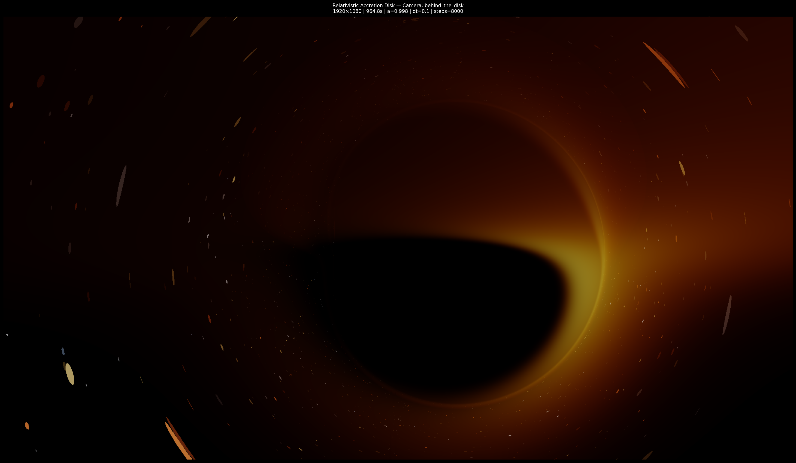
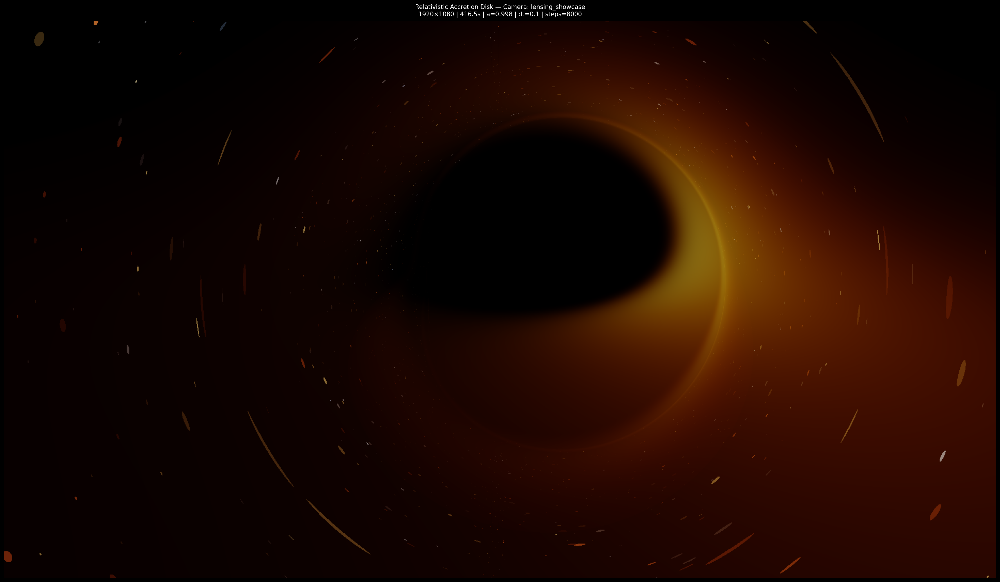
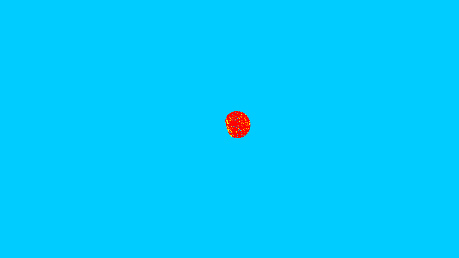
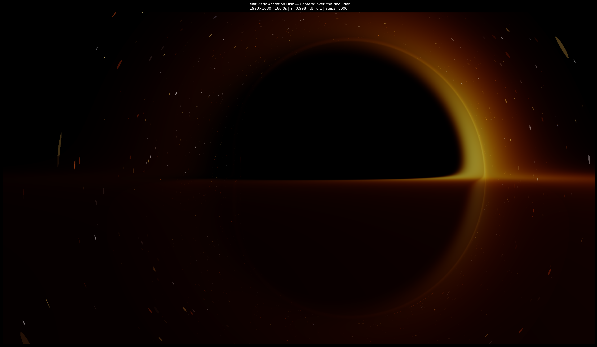
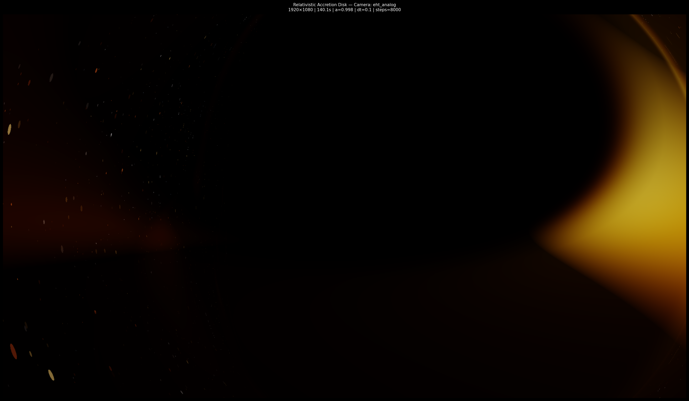
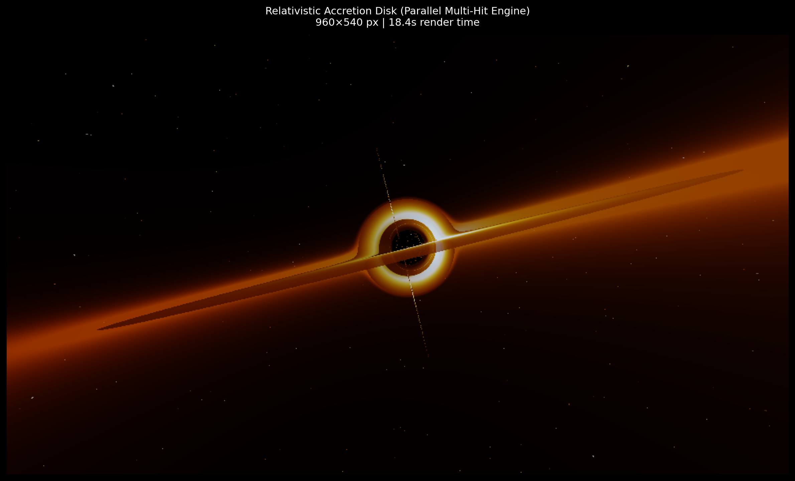

# KERR-TRACE

### A numerical null-geodesic raytracer for Kerr spacetime

KERR-TRACE is a research-oriented General Relativity raytracer for exploring how light propagates around rotating black holes.

Given an observer and an image plane, the renderer launches photon trajectories backward from the camera and numerically integrates them through Kerr or Schwarzschild spacetime. Rays may intersect an emitting accretion disk, escape toward a celestial background, orbit through strongly curved regions of spacetime, or terminate at the black hole.

The resulting image is therefore not produced by placing a dark sphere and glowing disk inside a conventional 3D scene. The black-hole shadow, gravitational lensing, higher-order disk images, and distorted background sky emerge from the trajectories taken by light through the spacetime metric.

KERR-TRACE began as an attempt to answer a fairly simple question:

> **What happens if I render a black hole from the equations instead of trying to imitate what one looks like?**

It has since grown into a larger computational project containing the geodesic integrator, relativistic disk rendering, numerical diagnostics, camera and animation systems, Blender integration, and a lightweight interface for exploring the renderer without having to work directly with the Python internals.

KERR-TRACE is still an evolving numerical model rather than a GRMHD or full radiative-transfer code. The assumptions, approximations, coordinate choices, and numerical guardrails used by the renderer are documented in [Physics & Numerical Notes](#physics--numerical-notes).

<!-- HERO IMAGE -->
<p align="center">
  
</p>
<p align="center">
  <i>Hero Render: Near-extremal Kerr black hole rendered at a = 0.998 showing Doppler boosting, accretion disk lensing, and photon sphere curvature.</i>
</p>

---

## Contents

- [Gallery](#gallery)
- [What KERR-TRACE Computes](#what-kerr-trace-computes)
- [The Rendering Pipeline](#the-rendering-pipeline)
- [Diagnostics — Doctor](#diagnostics--doctor)
- [Animation and Camera Motion](#animation-and-camera-motion)
- [Blender Integration](#blender-integration)
- [Getting Started](#getting-started)
- [Using the Renderer](#using-the-renderer)
- [Web Interface and API](#web-interface-and-api)
- [Distributed Rendering](#distributed-rendering)
- [Repository Structure](#repository-structure)
- [Current Limitations](#current-limitations)
- [Roadmap](#roadmap)
- [Citation](#citation)
- [License](#license)
- [Physics & Numerical Notes](#physics--numerical-notes)
  - [Conventions and Geometrical Units](#1-conventions-and-geometrical-units)
  - [Kerr Spacetime](#2-kerr-spacetime)
  - [Horizons and the ISCO](#3-horizons-and-the-isco)
  - [Null Geodesics and Constants of Motion](#4-null-geodesics-and-constants-of-motion)
  - [Backward Raytracing](#5-backward-raytracing)
  - [Numerical Integration](#6-numerical-integration)
  - [Adaptive Stepping](#7-adaptive-stepping)
  - [Ray Termination](#8-ray-termination)
  - [Accretion-Disk Intersection](#9-accretion-disk-intersection)
  - [Disk Motion and Emission](#10-disk-motion-and-emission)
  - [Relativistic Frequency Shifts](#11-relativistic-frequency-shifts)
  - [The Celestial Background](#12-the-celestial-background)
  - [Boyer-Lindquist Coordinate Pathologies](#13-boyer-lindquist-coordinate-pathologies)
  - [The Polar-Axis Artifact](#14-the-polar-axis-artifact)
  - [Numerical Guardrails](#15-numerical-guardrails)
  - [Conservation and Doctor Diagnostics](#16-conservation-and-doctor-diagnostics)
  - [Model Assumptions](#17-model-assumptions)
  - [Numerical Limitations](#18-numerical-limitations)

---

# Gallery

> *All images below are generated by KERR-TRACE from numerically integrated photon trajectories.*

The appearance changes dramatically with observer position, inclination, spin, field of view, and the emission model. The warped structures around the shadow are not geometry placed around a sphere; they are different families of photon trajectories reaching the observer.

<table>
<tr>
<td width="50%">

</td>
<td width="50%">

</td>
</tr>
<tr>
<td align="center"><i>Schwarzschild (a = 0.0) — Symmetric Lensing (Luminet 1979 Geometry)</i></td>
<td align="center"><i>Near-Extremal Kerr (a = 0.998) — Asymmetric High Inclination (85°)</i></td>
</tr>
<tr>
<td width="50%">

</td>
<td width="50%">

</td>
</tr>
<tr>
<td align="center"><i>Close Observer — Strong Equatorial Frame Dragging</i></td>
<td align="center"><i>Behind-the-Disk View — Secondary Lensed Accretion Arc</i></td>
</tr>
</table>

---

# What KERR-TRACE Computes

At its core, KERR-TRACE is a **backward null-geodesic raytracer**.

For every pixel in an image:

1. A ray is constructed from the observer through the corresponding point on the virtual image plane.
2. The ray is transformed into the coordinate representation used by the spacetime integrator.
3. Its null trajectory is integrated backward through Kerr or Schwarzschild spacetime.
4. During integration, the renderer checks whether the ray:
   - crosses the emitting disk,
   - approaches the black hole,
   - escapes the simulation domain,
   - or exhausts the integration budget.
5. Disk intersections contribute relativistically shifted emission.
6. Escaping rays sample the celestial background.
7. The accumulated radiance becomes the final pixel.

Conceptually:

```text
Camera
  │
  ├── pixel (x, y)
  │
  ▼
Initial photon direction
  │
  ▼
Null geodesic integration
  │
  ├──── horizon / capture ───────────────► black
  │
  ├──── disk intersection ───────────────► emitted radiation
  │
  └──── escape ──────────────────────────► celestial background
                                                │
                                                ▼
                                      gravitationally lensed sky
```

There is consequently no polygonal "black-hole object" inside the renderer.

The shadow is an image-space consequence of which photon trajectories fail to connect the observer to an emitting source. Likewise, the apparent arcs and duplicated structures of the accretion disk are produced by gravitational lensing rather than by duplicated geometry.

---

# The Rendering Pipeline

KERR-TRACE separates the problem into a few fairly independent pieces.

### Spacetime

The geodesic engine integrates photon trajectories through Kerr or Schwarzschild geometry.

The rotating case uses the Kerr metric in Boyer-Lindquist coordinates and tracks the constants of motion associated with the spacetime's symmetries.

### Observer

The camera defines the observer position, orientation, field of view, and image plane.

Camera rays are generated independently of the geodesic integrator, which makes it possible to use the same physics engine for static renders, scripted camera presets, animation paths, and Blender cameras.

### Accretion disk

The current disk model provides the emitting matter sampled when photon trajectories intersect the disk.

Its orbital motion follows Kerr Keplerian angular velocity,

$$
\Omega(r)=
\frac{\sqrt{M}}
{r^{3/2}+a\sqrt{M}},
$$

with inner regions orbiting more rapidly than outer regions.

The renderer can account for relativistic frequency shifts and uses a thermal emission model to convert disk intersections into observed radiance.

<p align="center">
  
</p>
<p align="center">
  <i>Edge-on render selected to emphasize Doppler boosting and lensed disk arches while avoiding polar-axis numerical artifacts.</i>
</p>

### Celestial background

Rays which escape the strong-field region sample a distant celestial sphere.

This may be a procedural star field or an equirectangular sky texture. Because the lookup occurs **after geodesic integration**, the background is naturally distorted by gravitational lensing.

Stars are therefore not warped using a post-processing displacement map. Their apparent positions are determined by the photon trajectories reaching the observer.

<p align="center">
  
</p>
<p align="center">
  <i>Celestial background lensing showcase: High-resolution production render displaying background stars and nebulae stretching into Einstein arcs around the critical curve.</i>
</p>

### Image formation

Radiance accumulated along the ray is converted into the final image and passed through the output/tonemapping stage.

The renderer is deliberately structured so that image processing remains downstream of the geodesic calculation. Rendering choices should alter how physically generated data is displayed, not alter the photon trajectories themselves.

---

# Diagnostics — Doctor

A visually convincing render is not enough to establish that a numerical geodesic integrator is behaving correctly.

KERR-TRACE therefore includes a diagnostic subsystem referred to as **Doctor**.

Doctor exposes information normally hidden behind the final RGB image and allows the simulation to be inspected ray-by-ray.

Depending on the diagnostic mode, this can include quantities such as:

- ray termination state,
- capture and escape regions,
- integration step count,
- number of disk intersections,
- minimum radius reached,
- orbit count,
- polar excursion,
- conservation drift,
- Hamiltonian/null-condition drift,
- and other quantities useful for identifying unstable regions of the image.

A normal render answers:

> *What does the observer see?*

Doctor is intended to answer:

> *Why did the renderer produce that pixel?*

<p align="center">
  
</p>
<p align="center">
  <i>Doctor Diagnostic Tensor Map: Spatial diagnostic visualization mapping ray termination reasons, step counts, and minimum approach radii across the image plane.</i>
</p>

This became particularly useful while investigating small groups of anomalous pixels near the shadow boundary and coordinate-sensitive trajectories near the polar axis.

Doctor is not a replacement for formal convergence testing, but it provides a practical way of exposing numerical behaviour that would otherwise be hidden by the final image.

---

# Animation and Camera Motion

The renderer is not restricted to a single fixed observer.

Camera trajectories can be described using native Python interpolation, including Catmull-Rom and cubic Bézier paths. This allows the observer to move continuously through the scene while every frame is independently raytraced from the corresponding camera state.

Animation therefore does **not** rotate a pre-rendered image of the black hole.

For every frame:

```text
camera state(t)
      │
      ▼
new image plane
      │
      ▼
new photon initial conditions
      │
      ▼
full geodesic render
      │
      ▼
frame(t)
```

This distinction matters because changing the observer position genuinely changes the set of photon trajectories reaching the camera.

The disk model can also evolve with simulation time, allowing camera motion and time-dependent emitting structure to be treated separately.

---

# Blender Integration

KERR-TRACE can also be used as a custom Blender render engine.

Blender provides:

- camera placement,
- camera constraints,
- Bézier animation paths,
- keyframing,
- timeline control,
- and general scene authoring.

KERR-TRACE replaces the actual image formation step.

When Blender requests a frame, the integration layer reads the evaluated camera state and passes it to the raytracer. The resulting image is returned to Blender as the render result.

This gives Blender's animation workflow without pretending that the black hole itself is a conventional polygonal object.

<p align="center">
  
</p>
<p align="center">
  <i>Blender Integration: Evaluated 3D over-the-shoulder camera trajectory keyframed inside Blender and passed directly to KERR-TRACE null-geodesic engine.</i>
</p>

A black-hole shadow is not a solid surface that can be represented faithfully by a mesh. The accretion flow is likewise an emitting distribution of matter rather than a rigid opaque disk.

For this project, the physically meaningful "3D interaction" comes primarily from moving the observer and recomputing the light paths.

---

# Getting Started

## Requirements

Clone the repository:

```bash
git clone https://github.com/Spidey6978/null-geodesic-raytracer.git
cd null-geodesic-raytracer
```

Install the Python dependencies:

```bash
pip install -r requirements.txt
```

---

# Using the Renderer

## Render a single frame

```bash
python -m scripts.render_kernel \
    --spin 0.998 \
    --preset hero \
    --out output/hero_1080p.png
```

The CLI is useful for experimentation because simulation parameters can be changed without modifying the underlying constants or renderer implementation.

---

## Python interface

The renderer can also be called programmatically:

```python
from core.config import (
    RenderConfig,
    BlackHoleConfig,
    CameraConfig,
    RenderMode,
)
from api.engine import render_frame_from_config

config = RenderConfig(
    black_hole=BlackHoleConfig(
        mass=1.0,
        spin=0.998,
    ),
    camera=CameraConfig(
        preset="hero",
        fov=100.0,
    ),
    mode=RenderMode.PRODUCTION,
    skybox_path="procedural",
)

meta = render_frame_from_config(
    config,
    "output/my_blackhole.png",
)

print(f"Rendered in {meta['render_time_s']:.2f} seconds.")
```

---

# Web Interface and API

KERR-TRACE also exposes the renderer through a lightweight web interface and FastAPI backend.

The web interface is intentionally treated as a **control surface for the renderer**, rather than the center of the project.

It can be used to configure the spacetime, observer and rendering parameters, submit renders, inspect progress, and retrieve generated artifacts.

Start the local server with:

```bash
python -m uvicorn api.main:app --reload --port 8000
```

Then open:

```text
http://localhost:8000/ui
```

Public ngrok launcher:
```bash
python scripts/run_public_server.py --domain touchily-steamerless-alyssa.ngrok-free.dev
```

Interactive API documentation is available at:

```text
http://localhost:8000/docs
```

The REST API includes endpoints for operations such as:

```text
POST /api/v1/renders/image
POST /api/v1/renders/animation
```

along with job-status and artifact retrieval endpoints.

---

# Distributed Rendering

Long animations are naturally parallelizable at the frame level.

KERR-TRACE therefore includes an optional distributed execution layer built around:

```text
FastAPI
   │
   ▼
Redis
   │
   ▼
Celery workers
   │
   ├── frame 001
   ├── frame 002
   ├── frame 003
   └── ...
```

The complete stack can be launched with:

```bash
docker compose up --build
```

The distributed infrastructure is not required to use the underlying raytracer. It exists primarily to make long-running image and animation jobs easier to schedule, monitor, and scale.

---

# Repository Structure

```text
├── api/
│   ├── main.py
│   ├── routes.py
│   ├── schemas.py
│   ├── engine.py
│   ├── rate_limiter.py
│   └── static/
│
├── core/
│   ├── geodesics.py
│   ├── camera.py
│   ├── skybox.py
│   ├── config.py
│   └── constants.py
│
├── doctor/
│   └── ...
│
├── scripts/
│   ├── render_kernel.py
│   ├── run_public_server.py
│   └── cam_presets.py
│
├── workers/
│   ├── celery_app.py
│   └── tasks.py
│
├── docker-compose.yml
├── Dockerfile
└── requirements.txt
```

The main conceptual separation is:

```text
core/       → physics and ray construction
doctor/     → numerical diagnostics
scripts/    → production rendering
api/        → external interface
workers/    → distributed execution
```

This separation is intentional: the geodesic engine should remain usable without requiring the web interface, Blender, Celery, or any other surrounding infrastructure.

---

# Current Limitations

KERR-TRACE should not be interpreted as a complete astrophysical model of an accreting black hole.

The current implementation makes several deliberate simplifications.

Most importantly:

- the background spacetime is prescribed rather than dynamically evolved;
- the renderer does not perform a GRMHD simulation of the accreting plasma;
- the accretion disk is an emission model rather than a self-consistently evolved fluid;
- radiative-transfer effects are simplified compared with dedicated astrophysical transport codes;
- photon propagation is treated in the geometric-optics regime;
- Boyer-Lindquist coordinates introduce numerical difficulties in coordinate-degenerate regions;
- all trajectories are integrated with finite precision and a finite integration budget;
- disk intersections are represented numerically rather than by evolving a continuous plasma volume;
- the visual appearance of the disk depends partly on the chosen emission prescription.

These limitations are important.

The purpose of KERR-TRACE is not to replace specialized GRMHD or radiative-transfer software. It is to provide a transparent numerical environment for experimenting with null geodesics, strong-field gravitational lensing, relativistic image formation, and the numerical problems that appear while trying to render them.

---

# Roadmap

KERR-TRACE is still being actively developed.

Some directions currently worth exploring include:

- Kerr-Schild coordinate support;
- direct comparison between Boyer-Lindquist and Kerr-Schild integrations;
- stronger convergence and conservation testing;
- richer Doctor diagnostic maps;
- improved time-dependent accretion structure;
- more complete relativistic radiative transfer;
- progressive rendering;
- GPU acceleration;
- interactive observer manipulation;
- and improved animation/render orchestration.

The long-term goal is not simply to make prettier black-hole images.

It is to make the relationship between

```text
spacetime
→ photon trajectory
→ emitting matter
→ observer
→ image
```

as inspectable as possible.

---

# Citation

If KERR-TRACE is useful in academic work, research reports, or visualization projects, it can be cited as:

```bibtex
@software{gopani_kerr_trace_2026,
  author = {Veer Gopani},
  title  = {KERR-TRACE: A Distributed Null Geodesic Raytracer for Kerr Spacetime},
  url    = {https://github.com/Spidey6978/null-geodesic-raytracer},
  year   = {2026}
}
```

---

# License

KERR-TRACE is released under the MIT License.

---

# Physics & Numerical Notes

This section documents the mathematical conventions, physical assumptions, and numerical decisions used by the renderer.

It is intentionally more detailed than the rest of the README.

The distinction between **physical behaviour**, **coordinate behaviour**, and **numerical behaviour** is particularly important in General Relativity. A feature appearing in a rendered image is not automatically physical simply because the underlying metric is physically correct; numerical integration, coordinate singularities, finite precision, termination criteria, and emission assumptions can all influence the result.

The goal of this section is therefore not merely to list equations, but to document how those equations become pixels.

---

## 1. Conventions and Geometrical Units

The geodesic engine uses geometrical units,

$$
G=c=1.
$$

The black-hole mass is additionally used as the characteristic scale, so calculations are commonly expressed with

$$
M=1.
$$

This removes explicit factors of $G$ and $c$ from the geodesic equations and makes the geometry scale invariant.

Physical dimensions can subsequently be restored by multiplying by the appropriate powers of

$$
r_g=\frac{GM}{c^2}
$$

and

$$
t_g=\frac{GM}{c^3}.
$$

Consequently, a raytraced geometry calculated for $M=1$ describes the same dimensionless Kerr geometry for black holes of different physical masses. Changing the physical mass changes the physical length and time represented by one simulation unit, rather than the dimensionless shape of the spacetime.

The Schwarzschild radius is

$$
r_s=2M.
$$

With $M=1$,

$$
r_s=2.
$$

---

## 2. Kerr Spacetime

KERR-TRACE models an isolated rotating black hole using the Kerr solution.

In Boyer-Lindquist coordinates

$$
(t,r,\theta,\phi),
$$

two frequently occurring functions are

$$
\Sigma=r^2+a^2\cos^2\theta
$$

and

$$
\Delta=r^2-2Mr+a^2.
$$

The line element is

$$
\begin{aligned}
ds^2 ={}&
-\left(1-\frac{2Mr}{\Sigma}\right)dt^2
-\frac{4Mar\sin^2\theta}{\Sigma}\,dt\,d\phi \\
&+\frac{\Sigma}{\Delta}dr^2
+\Sigma\,d\theta^2 \\
&+\left(
r^2+a^2+
\frac{2Ma^2r\sin^2\theta}{\Sigma}
\right)\sin^2\theta\,d\phi^2.
\end{aligned}
$$

The off-diagonal $g_{t\phi}$ term is responsible for the coupling between time and azimuth associated with rotational frame dragging.

For

$$
a=0,
$$

the metric reduces to Schwarzschild spacetime.

---

## 3. Horizons and the ISCO

For Kerr spacetime, the roots of

$$
\Delta=0
$$

occur at

$$
r_\pm=M\pm\sqrt{M^2-a^2}.
$$

The outer root,

$$
r_+=M+\sqrt{M^2-a^2},
$$

corresponds to the outer event horizon in Boyer-Lindquist coordinates.

KERR-TRACE also uses the radius of the innermost stable circular orbit when constructing the disk model.

For equatorial circular motion, define

$$
Z_1=
1+
(1-a^2)^{1/3}
\left[
(1+a)^{1/3}
+
(1-a)^{1/3}
\right],
$$

$$
Z_2=
\sqrt{3a^2+Z_1^2}.
$$

The ISCO radius is then

$$
r_{\mathrm{ISCO}}
=
3+Z_2
\mp
\sqrt{
(3-Z_1)
(3+Z_1+2Z_2)
}.
$$

The sign distinguishes prograde and retrograde orbital families.

The current renderer primarily uses the prograde branch for the accretion-disk inner radius.

---

## 4. Null Geodesics and Constants of Motion

Photons follow null trajectories satisfying

$$
ds^2=0.
$$

Equivalently, their four-momentum satisfies

$$
g^{\mu\nu}p_\mu p_\nu=0.
$$

Kerr spacetime possesses enough symmetry to make photon motion completely integrable.

Because the metric is stationary,

$$
\partial_t g_{\mu\nu}=0,
$$

the covariant time momentum is conserved:

$$
E=-p_t.
$$

Because the spacetime is axisymmetric,

$$
\partial_\phi g_{\mu\nu}=0,
$$

the azimuthal momentum is also conserved:

$$
L_z=p_\phi.
$$

A further hidden symmetry produces the Carter constant $Q$.

For null motion, one useful representation is

$$
Q
=
p_\theta^2
+
\cos^2\theta
\left(
\frac{L_z^2}{\sin^2\theta}
-a^2E^2
\right).
$$

Together,

$$
E,\qquad L_z,\qquad Q
$$

strongly constrain the possible photon trajectories.

The existence of these conserved quantities is also extremely useful numerically: a trajectory which exhibits substantial unexplained drift in quantities that should remain conserved is immediately suspicious.

---

## 5. Backward Raytracing

The renderer uses backward raytracing.

Instead of emitting photons from every possible point in the universe and hoping some eventually reach the camera, one photon trajectory is initialized for each image pixel and propagated backward from the observer.

For an image with resolution

$$
W\times H,
$$

the renderer therefore begins with approximately

$$
N_{\mathrm{rays}}=WH
$$

primary rays.

Each image-space direction is transformed into an initial photon direction corresponding to the observer's local camera frame.

The ray is then integrated until a termination condition is reached.

Backward raytracing is computationally convenient because every integrated primary ray contributes directly to an image pixel.

---

## 6. Numerical Integration

Photon trajectories do not generally have image-space solutions that can simply be evaluated once per pixel.

KERR-TRACE therefore integrates the equations of motion numerically.

The current production integrator uses fourth-order Runge-Kutta integration.

For a state vector

$$
y
$$

satisfying

$$
\frac{dy}{d\lambda}=f(y),
$$

one RK4 step is

$$
k_1=f(y_n),
$$

$$
k_2=f\left(y_n+\frac{h}{2}k_1\right),
$$

$$
k_3=f\left(y_n+\frac{h}{2}k_2\right),
$$

$$
k_4=f(y_n+hk_3),
$$

followed by

$$
y_{n+1}
=
y_n+
\frac{h}{6}
\left(
k_1+2k_2+2k_3+k_4
\right).
$$

RK4 provides a useful balance between implementation complexity, numerical accuracy, and throughput for large image renders.

The appropriate step size is not uniform throughout the spacetime, however.

A step that is perfectly adequate far from the black hole may be much too large near the horizon, a turning point, the disk, or a coordinate-degenerate region.

---

## 7. Adaptive Stepping

KERR-TRACE therefore modifies the local integration step according to the state of the trajectory.

Conceptually,

```text
base step
   │
   ├── radial scaling
   ├── angular scaling
   ├── polar-axis protection
   └── far-field scaling
          │
          ▼
      local step
```

The purpose is not to change the geodesic.

It is to change how finely the same trajectory is sampled numerically.

Smaller steps are used where the coordinate representation or trajectory changes rapidly, while larger steps can be used in numerically quieter regions.

This is particularly important for near-critical rays, which may spend a comparatively long affine interval near unstable photon trajectories before either escaping or being captured.

---

## 8. Ray Termination

Every ray must eventually leave the integration loop.

The production renderer therefore classifies trajectories into several broad outcomes.

### Capture

A ray entering the numerical capture region near the outer horizon is terminated as captured.

Because Boyer-Lindquist coordinates become singular at the horizon, the integrator does not attempt to evolve trajectories indefinitely through that coordinate boundary.

### Escape

A ray reaching the outer simulation boundary with outward motion is treated as escaping toward the distant celestial background.

Its final direction is used to determine the corresponding sky sample.

### Integration-budget exhaustion

A small number of trajectories may remain unresolved when the maximum integration step budget is reached.

These rays are diagnostically distinct from rays known to have escaped or been captured.

This distinction matters: "did not finish within the numerical budget" is not a physical outcome.

Doctor can be used to locate such rays and determine whether they cluster around dynamically difficult regions.

---

## 9. Accretion-Disk Intersection

The accretion structure is currently modeled around the equatorial plane,

$$
\theta=\frac{\pi}{2}.
$$

During integration, the renderer detects crossings of the disk region and records information about the intersection.

A photon may cross the equatorial plane multiple times before reaching the observer.

This is physically important.

Strong gravitational lensing allows the observer to receive photons associated with different image orders of the disk. Some trajectories may loop around the black hole before intersecting emitting material or escaping.

The renderer therefore supports multiple disk intersections rather than assuming that the first equatorial crossing completely determines the pixel.

For production performance, the number of intersections retained by the rendering path may be bounded. This is a numerical/rendering budget rather than a fundamental statement that additional crossings cannot occur.

---

## 10. Disk Motion and Emission

The current accretion model assumes approximately circular equatorial orbital motion.

The Kerr Keplerian angular velocity is

$$
\Omega(r)
=
\frac{\sqrt{M}}
{r^{3/2}+a\sqrt{M}}.
$$

For $M=1$,

$$
\Omega(r)
=
\frac{1}
{r^{3/2}+a}.
$$

This naturally produces differential rotation: matter closer to the black hole advances in azimuth more rapidly than matter farther out.

Time-dependent structure can therefore be advected according to

$$
\phi_{\mathrm{adv}}
=
\phi-\Omega(r)t.
$$

The renderer can use procedural structure such as multi-octave noise to perturb the otherwise smooth emission profile and provide evolving disk texture.

This procedural structure should be interpreted as a visualization/emission model, **not as a GRMHD solution for turbulent plasma**.

The distinction is intentional.

The geodesic propagation is derived from the spacetime geometry; the detailed appearance of the emitting matter is a separate modeling choice.

---

## 11. Relativistic Frequency Shifts

Radiation emitted by orbiting matter is observed at a frequency different from the frequency measured in the emitter's local frame.

A useful general definition of the redshift factor is

$$
g
=
\frac{\nu_{\mathrm{obs}}}
{\nu_{\mathrm{em}}}
=
\frac{
k_\mu u^\mu_{\mathrm{obs}}
}{
k_\nu u^\nu_{\mathrm{em}}
},
$$

where

- $k^\mu$ is the photon four-momentum,
- $u^\mu_{\mathrm{obs}}$ is the observer four-velocity,
- $u^\mu_{\mathrm{em}}$ is the emitter four-velocity.

This single factor contains contributions associated with gravitational redshift and the relative motion between emitting matter and the observer.

The invariance

$$
\frac{I_\nu}{\nu^3}
=
\text{constant}
$$

along a vacuum ray implies

$$
I_{\nu,\mathrm{obs}}
=
g^3 I_{\nu,\mathrm{em}}
$$

for specific intensity.

When working with frequency-integrated intensity, an additional frequency transformation leads to the familiar

$$
I_{\mathrm{obs}}
\propto
g^4 I_{\mathrm{em}}.
$$

This is responsible for much of the strong brightness asymmetry visible in highly inclined renders of a rapidly rotating disk.

<p align="center">
  
</p>
<p align="center">
  <i>Relativistic Frequency Shift (EHT Analog Render): High-resolution render illustrating strong Doppler boosting on the approaching side (left, brightened) vs receding side (right, dimmed).</i>
</p>

The approaching side can be substantially Doppler boosted while the receding side is dimmed and redshifted.

---

## 12. The Celestial Background

A ray which escapes the local black-hole environment must still receive a color.

KERR-TRACE treats the distant sky as a celestial sphere.

The final escape direction is converted into angular coordinates and used to sample either:

- a procedural star field,
- or an equirectangular sky/HDR texture.

If the normalized escape direction is

$$
\mathbf{n}=(n_x,n_y,n_z),
$$

one possible equirectangular mapping is

$$
u
=
\frac{1}{2}
+
\frac{\operatorname{atan2}(n_z,n_x)}{2\pi},
$$

$$
v
=
\frac{1}{2}
-
\frac{\arcsin(n_y)}{\pi}.
$$

The crucial point is that this mapping occurs **after the photon has traversed the curved spacetime**.

Consequently, the celestial background is lensed by the geodesic solution itself.

Near the critical curve, tiny differences in initial camera direction can correspond to enormous differences in the final escape direction. This produces the stretched, repeated and strongly distorted star patterns characteristic of strong gravitational lensing.

<p align="center">
  <i>Examples of celestial-background lensing are discussed in the text; explicit skybox-grid visualisations have been removed for clarity.</i>
</p>

---

## 13. Boyer-Lindquist Coordinate Pathologies

Boyer-Lindquist coordinates are extremely useful analytically, but they are not numerically innocent.

Two regions are particularly important.

### The event horizon

Because

$$
\Delta\rightarrow0
$$

at the horizon, several Boyer-Lindquist metric components or coordinate derivatives become singular even though an infalling observer does not encounter a physical curvature singularity there.

The coordinate chart is therefore poorly suited to integrating smoothly through the horizon.

### The polar axis

At

$$
\theta=0,\pi,
$$

the azimuthal coordinate $\phi$ becomes degenerate.

This is analogous to longitude at the geographic poles: infinitely many longitude values refer to the same physical point.

The spacetime itself is not singular there merely because the coordinate representation becomes ill-conditioned.

This distinction became practically important during development because some trajectories passing close to the polar axis produced large coordinate changes and conspicuous image artifacts.

---

## 14. The Polar-Axis Artifact

One of the more persistent numerical artifacts encountered during development appeared as a narrow, approximately vertical beam extending from the black-hole region.

Investigation suggested a strong connection with trajectories passing near the Boyer-Lindquist polar coordinate singularity.

Near

$$
\theta\rightarrow0,\pi,
$$

we have

$$
\sin^2\theta\rightarrow0.
$$

Terms involving

$$
\frac{1}{\sin^2\theta}
$$

can therefore become extremely large in the coordinate equations.

A trajectory that is physically smooth may consequently undergo a very large numerical change in $\phi$ during one finite integration step.

Schematically,

$$
\Delta\phi
\approx
\frac{d\phi}{d\lambda}\Delta\lambda.
$$

If

$$
\left|\frac{d\phi}{d\lambda}\right|
$$

becomes very large while $\Delta\lambda$ remains finite, the integrator can skip across a substantial azimuthal interval in a single RK4 step.

In image space, errors affecting a narrow family of rays can become highly visible because neighboring camera pixels may correspond to qualitatively different final trajectories.

Importantly, the interpretation of this artifact is numerical and coordinate-dependent rather than evidence for a physical jet or beam emitted by the black hole.

<p align="center">
  
</p>
<p align="center">
  <i>The Polar-Axis Artifact (Production Render): Un-capped RK4 integration near θ → 0 causing a spurious vertical needle streak extending outward from the polar axis.</i>
</p>

A coordinate system without the same polar/horizon behaviour, such as Kerr-Schild coordinates, provides an important future comparison.

---

## 15. Numerical Guardrails

Rather than modifying the Kerr metric or artificially damping the photon dynamics, KERR-TRACE reduces the local affine step when the Boyer-Lindquist azimuthal coordinate becomes numerically dangerous.

The production implementation includes a guard of the form:

```python
dphi_scale = abs(L) / (sin2 + 1e-6)
polar_cap = 0.15 / dphi_scale if dphi_scale > 0.15 else 1.0

dt_local = (
    dt
    * min(max(r_factor * theta_factor, 1e-4), polar_cap)
    * far_factor
)
```

The intention is straightforward:

```text
trajectory approaches polar axis
             │
             ▼
      sin²(theta) becomes small
             │
             ▼
     estimated azimuthal rate grows
             │
             ▼
       local RK4 step shrinks
             │
             ▼
large one-step Δphi becomes less likely
```

This does **not** remove the Boyer-Lindquist coordinate singularity.

It only attempts to resolve trajectories approaching the problematic region with a sufficiently small numerical step.

### Before vs After Guardrail Verification

<table>
<tr>
<td width="50%">

</td>
<td width="50%">

</td>
</tr>
<tr>
<td align="center"><i>Guardrail OFF — Spurious Vertical Needle Artifact</i></td>
<td align="center"><i>Guardrail ON — Bounded Step & Smooth Shadow Boundary</i></td>
</tr>
</table>

The threshold itself is therefore a numerical parameter and should be validated through convergence and conservation tests rather than interpreted as a physical constant.

---

## 16. Conservation and Doctor Diagnostics

The constants of motion provide natural diagnostics for the integrator.

For an ideal Kerr null geodesic,

$$
E,\qquad L_z,\qquad Q
$$

should remain constant along the trajectory.

Likewise, the null Hamiltonian constraint should remain consistent with

$$
g^{\mu\nu}p_\mu p_\nu=0.
$$

In floating-point numerical integration these quantities will not remain mathematically exact.

The useful question is instead:

> How does the drift behave as integration proceeds, and does it converge as the numerical resolution is increased?

Doctor exists partly to make those questions visible.

<p align="center">
  
</p>
<p align="center">
  <i>Doctor Conservation & Step Convergence Map: Spatial tensor data tracking single-step stability and energy drift across the screen plane.</i>
</p>

Rather than only examining the final RGB render, diagnostic modes can expose regions where:

- conservation drift increases,
- unusually many integration steps are required,
- trajectories approach the horizon,
- trajectories orbit repeatedly,
- polar excursions become extreme,
- termination classifications change unexpectedly,
- or the integration budget is exhausted.

A clean image does not prove a clean integration.

Conversely, a strange-looking image is not necessarily incorrect.

Diagnostics provide the bridge between those two observations.

---

## 17. Model Assumptions

A useful way to interpret KERR-TRACE is to separate the project into three layers.

### Layer 1 — spacetime geometry

The photon trajectories are propagated through a prescribed Kerr or Schwarzschild geometry.

The black hole itself is not approximated as a Newtonian lens or screen-space distortion.

### Layer 2 — numerical representation

The continuous geodesic equations are represented by finite-precision floating-point states and integrated using finite affine steps.

Adaptive stepping, capture thresholds, escape boundaries, disk-crossing detection, and maximum-step budgets therefore belong to the numerical model.

### Layer 3 — astrophysical appearance

The accretion disk's temperature, texture, turbulence, opacity assumptions, and emission profile determine what radiation is assigned to intersections with emitting matter.

These choices influence the final appearance but are conceptually separate from the underlying null-geodesic trajectories.

This separation is important because two renders can use identical spacetime physics while looking very different due to different emission models.

Likewise, an attractive emission model cannot compensate for an unstable geodesic integration.

---

## 18. Numerical Limitations

Several numerical questions remain open or are still being improved.

### Coordinate dependence

The current production path uses Boyer-Lindquist coordinates.

Although physically valid outside their coordinate singularities, they are not ideal everywhere numerically.

A Kerr-Schild implementation would provide both a more horizon-friendly coordinate representation and a valuable independent comparison against the current integrator.

### Finite integration budget

Every production ray is allowed only a finite number of steps.

Near-critical trajectories may require substantially more work than ordinary escaping rays.

A ray reaching the step budget should therefore be interpreted as **numerically unresolved**, not automatically classified as captured or escaped.

### Finite disk-hit storage

The production renderer may retain only a bounded number of disk intersections per ray for performance reasons.

Higher-order intersections beyond that budget are consequently not represented in the final radiance calculation.

### Floating-point precision

The renderer relies on floating-point arithmetic and therefore cannot preserve analytic invariants exactly.

Particularly difficult trajectories can amplify small numerical errors.

### Adaptive-step heuristics

The adaptive stepping strategy contains thresholds chosen for numerical stability and performance.

These should be tested through parameter sweeps and convergence experiments rather than treated as fundamental constants.

### Emission model

The current accretion model is deliberately simpler than a full GRMHD + relativistic radiative-transfer pipeline.

The rendered images should therefore be interpreted as **relativistic raytracing visualizations under a chosen emission model**, not predictions of a particular astrophysical observation.

---

## Closing Note

KERR-TRACE started as a rendering project.

Working on it quickly turned the problem into something else.

Producing the image was only part of the challenge. The harder questions became:

- Why did this photon reach that pixel?
- Why did a neighboring photon not?
- Is a strange feature physical, numerical, or coordinate-dependent?
- How much numerical error is hidden inside an image that looks perfectly reasonable?
- Which parts of the final appearance come from General Relativity, and which come from the model used for the emitting matter?

That is ultimately what this repository is about.

The renders are the most visible output.

The trajectories underneath them are the actual project.