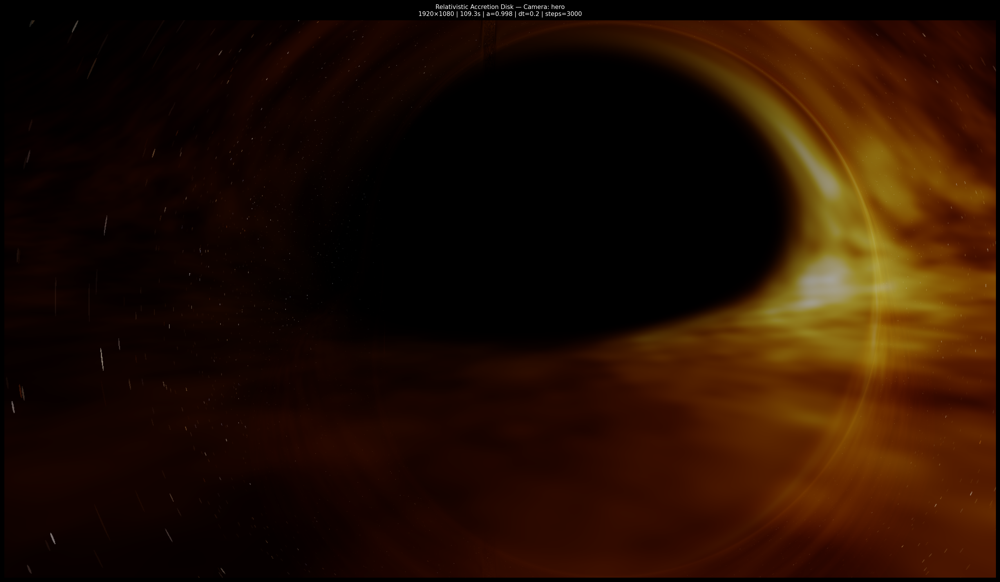
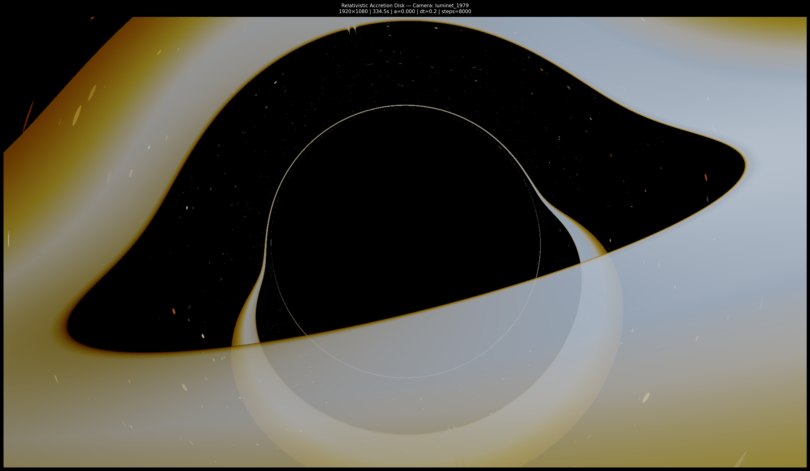
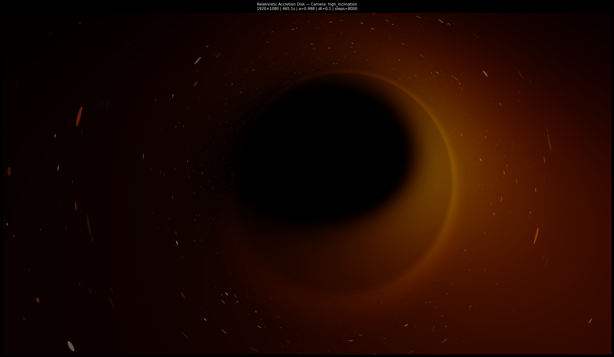
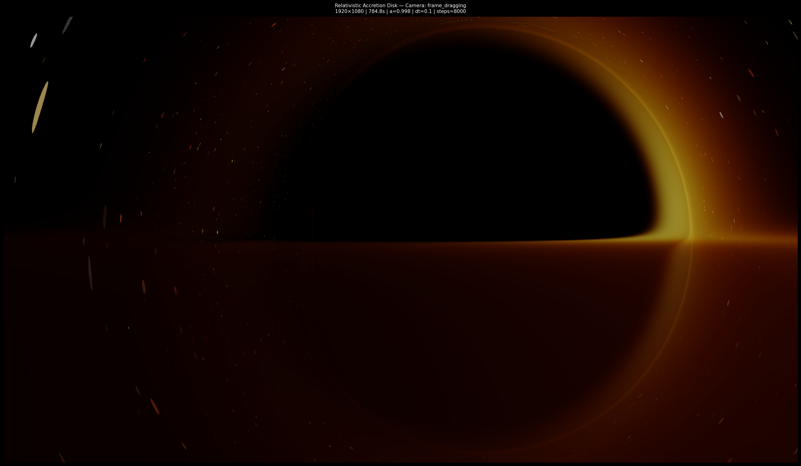
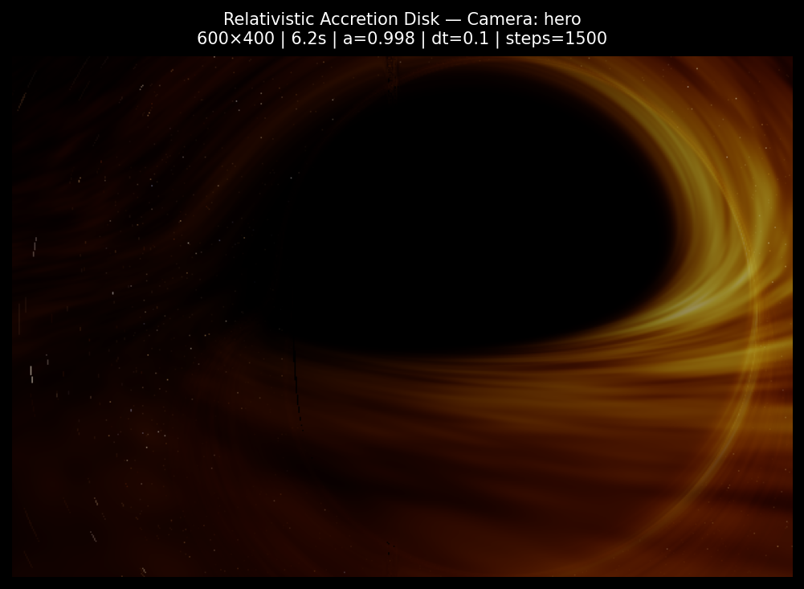
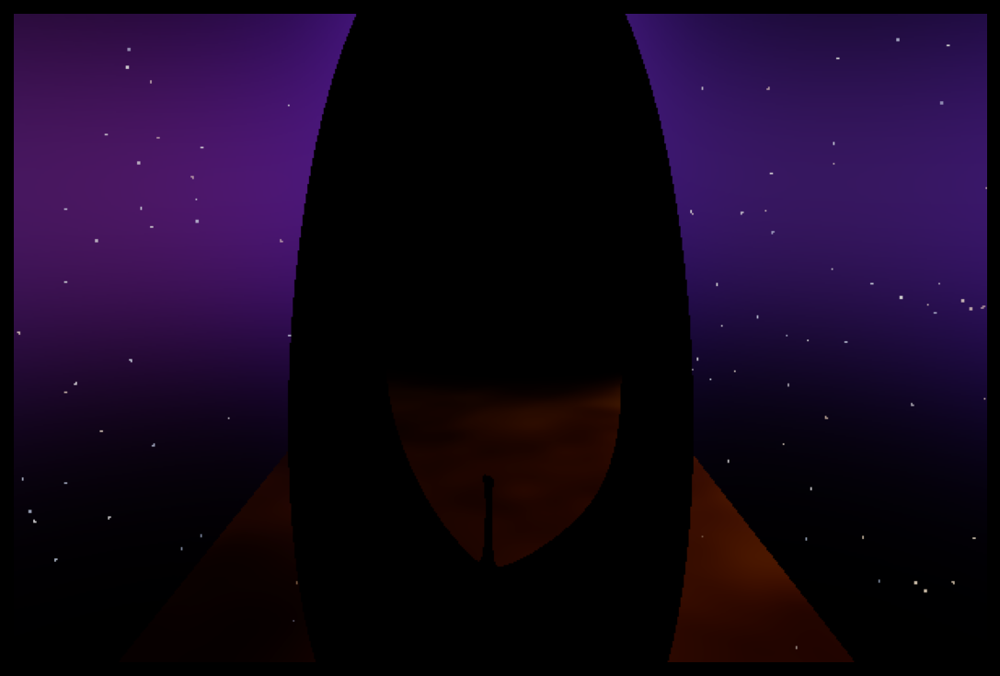
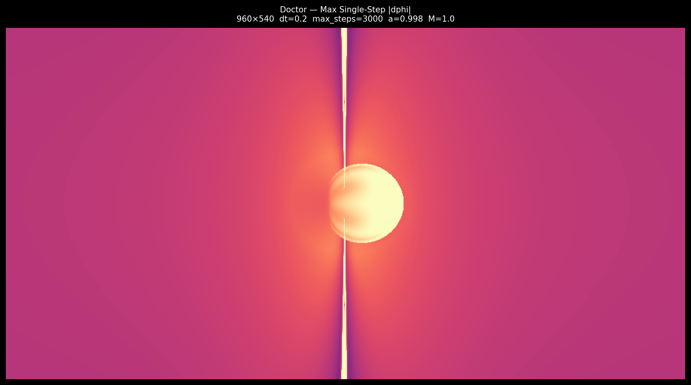
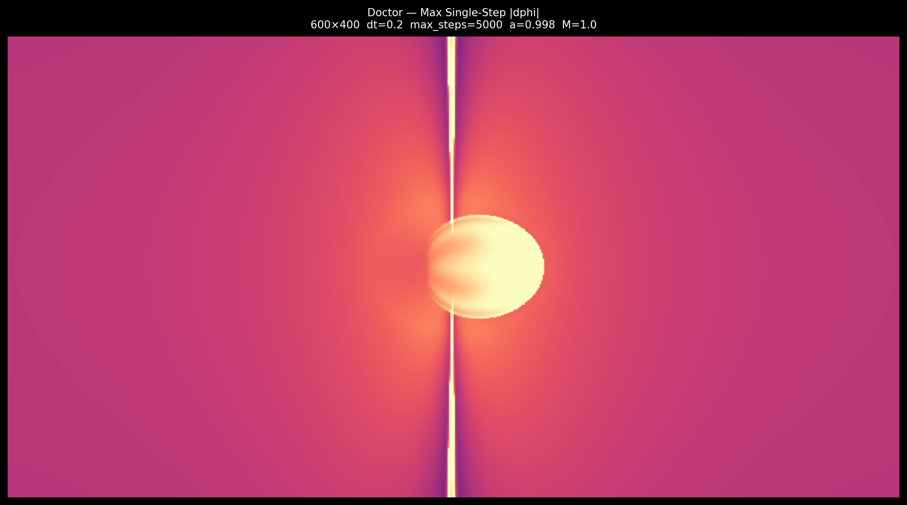

# KERR-TRACE — Null Geodesic Raytracer & Relativity Simulator

A research-oriented General Relativity raytracer and distributed rendering service that numerically integrates photon geodesics through curved Kerr spacetime to simulate gravitational lensing, relativistic accretion disks, and frame-dragging around black holes.

Unlike conventional graphics-based black hole renderers that rely on visual approximations or shader-space warps, **KERR-TRACE** traces light rays directly through Kerr and Schwarzschild spacetimes using exact metric tensors, conserved quantities, and adaptive RK4 numerical integration.


*Figure 1: High-resolution 1080p hero render of a near-extremal Kerr black hole ($a = 0.998$) with Keplerian differential rotation, Novikov-Thorne thermal envelope, and relativistic Doppler boosting.*

---

## 🖼️ Physical Render Gallery

To demonstrate the physical range of **KERR-TRACE**, the gallery below illustrates distinct gravitational spacetimes, inclination angles, and observer geometries:

| Schwarzschild ($a = 0.0$) | Near-Extremal Kerr ($a = 0.998$) |
| :---: | :---: |
|  |  |
| **Symmetric Lensing (Luminet 1979 Geometry)**: Non-rotating black hole showing symmetric photon ring and circular shadow. | **Asymmetric Lensing ($85^\circ$ Inclination)**: Strong frame-dragging and asymmetric shadow distortion. |

| Strong Frame-Dragging | Plasma Turbulence Advection ($t=0 \to t=2$) |
| :---: | :---: |
|  |  |
| **Close-Range Observer**: Equatorial viewing geometry exposing frame-dragging warping near ISCO ($r_{\text{ISCO}} = 1.237 r_g$). | **Time-Advected Plasma**: Multi-octave turbulence advected via Keplerian angular frequency $\Omega(r)$. |

---

## Highlights

### Relativistic Ray Tracing
* Implemented photon propagation in both Schwarzschild and Kerr spacetimes.
* Numerically integrates null geodesics rather than approximating lensing with shaders.
* Supports near-extremal Kerr black holes (`a ≈ 0.998`).
* Computes photon trajectories using conserved quantities:
  * Energy ($E$)
  * Angular Momentum ($L$)
  * Carter Constant ($Q$)

### Gravitational Lensing
* Black hole shadow formation
* Einstein rings
* Photon sphere structures
* Higher-order lensing images
* Multi-orbit photon trajectories
* Frame dragging around rotating black holes

### Accretion Disk Rendering
* Multi-hit disk intersections
* Front-side and back-side disk imaging
* Higher-order lensed disk images
* Relativistic viewing geometries
* Configurable disk parameters


*Figure 2: Physical breakdown of accretion disk emission features under extreme Kerr lensing:*
- **Approaching Side (Left / Foreground)**: Plasma moving toward the observer at relativistic speeds ($\sim 0.5c$). Intensity is strongly amplified by the relativistic Doppler factor $I_\nu \propto g^4$, shifting thermal emission into bright blueshifted tones.
- **Receding Side (Right)**: Plasma moving away from the observer. Emission is attenuated and redshifted into dim, warm tones.
- **Lensed Secondary Arch**: Light rays emitted from the back-side of the disk travel under the lower pole of the event horizon, bend around the photon sphere, and appear as a thin, highly brightened secondary arch above and below the shadow.

### Celestial Background Sampling
* Equirectangular HDRI background sampling
* Gravitational distortion of background nebulae and deep space constellations


*Figure 3: Gravitational lensing of background celestial panorama around the black hole shadow, producing distorted Einstein rings.*

### Numerical Stability
Significant effort has been devoted to handling strong-field numerical challenges:
* Adaptive timestep integration
* Horizon-aware capture logic
* Near-singularity safeguards
* Pole proximity handling
* NaN / Inf detection
* Geodesic termination diagnostics
* Strong-field stability testing

---

## Accomplishments

### Implemented physically-based black hole rendering
**Measured by**
* Support for Schwarzschild and Kerr metrics
* Stable rendering at near-extremal spin (`a ≈ 0.998`)
* Accurate black hole shadow generation

**By**
* Numerically integrating null geodesics in curved spacetime using conserved-quantity formulations.

---

### Rendered higher-order gravitational lensing structures
**Measured by**
* Einstein ring formation
* Multi-hit accretion disk imaging
* Secondary and higher-order photon paths

**By**
* Tracing photon trajectories through strong-field Kerr spacetime rather than relying on image-space distortion techniques.

---

### Built a physics validation framework
**Measured by**
* Hamiltonian drift monitoring
* Conservation checks for E, L, and Q
* Geodesic diagnostic visualization modes

**By**
* Developing a dedicated Doctor Mode subsystem for numerical verification and debugging.

---

### Improved strong-field integration robustness
**Measured by**
* Elimination of horizon leakage artifacts
* Stable photon capture behavior
* Successful rendering of complex Kerr configurations

**By**
* Introducing adaptive stepping, capture diagnostics, and singularity-aware safeguards.

---

## Metric Framework

The renderer is built around a metric-driven architecture.
Rather than hard-coding a specific spacetime solution, the simulation pipeline is designed so that alternative metrics can be integrated while reusing the same rendering and diagnostic infrastructure.

### Implemented Metrics
- **Schwarzschild Metric**: Non-rotating black holes, photon sphere modeling, event horizon capture.
- **Kerr Metric**: Rotating black holes, frame dragging, spin-dependent lensing, ergosphere studies.

### Planned Metrics
- Reissner–Nordström
- Kerr–Newman
- Naked singularity solutions
- User-defined experimental metrics

---

## Doctor Mode Diagnostics

Doctor Mode is a dedicated diagnostic subsystem (`doctor/diagnostics.py`) designed to validate the simulation and investigate unusual geodesic behavior. It computes 31 spatial diagnostic metrics per ray across the screen tensor.


*Figure 4: Doctor Mode diagnostic map plotting max single-step azimuthal step size $|d\phi|_{\text{step}}$ across 518,400 photon rays ($960 \times 540$).*

### Implemented Diagnostics
* Capture Maps
* Termination Maps
* Orbit Count Maps
* Disk Hit Maps
* Minimum Radius Maps
* Step Count Heatmaps
* Pole Proximity Diagnostics
* Ergosphere Occupancy Maps
* Impact Parameter Visualizations
* Hamiltonian Drift Maps
* Energy Drift Maps
* Angular Momentum Drift Maps
* Carter Constant Drift Maps

---

## Architecture Pipeline

```text
Camera Rays
      │
      ▼
Coordinate Conversion (Cartesian → Boyer-Lindquist)
      │
      ▼
Conserved Quantity Solver (E, L, Q)
      │
      ▼
Geodesic Integrator (Schwarzschild / Kerr)
      │
      ▼
Disk Intersection Engine (Multi-Hit Support)
      │
      ▼
Radiative Model & Skybox Sampler
      │
      ▼
Image Generation & Web UI Output
```

The rendering layer is intentionally separated from the physics layer, allowing future integration with external visualization tools such as Blender without modifying the geodesic engine.

---

## 🔬 Core Physics, Normalizations & Numerical Guardrails

### 1. Geometrical Unit Normalizations
To prevent numerical underflow/overflow and make the equations scale-invariant, the engine uses **geometrical units**:
$$G = c = M = 1$$
- **Length**: Radii $r$ are measured in units of gravitational radius $r_g = \frac{GM}{c^2}$.
- **Mass**: Measured in units of solar mass $M_\odot$.
- **Spin**: Dimensionless spin parameter $a = \frac{J}{M^2} \in [0.0, 0.998]$.
- **Schwarzschild Radius**: $r_s = 2M = 2.0$.
- **Outer Event Horizon**: $r_+ = M + \sqrt{M^2 - a^2}$.
- **Kerr ISCO Radius**: Computed analytically via Bardeen-Press-Teukolsky (1972) equations:
  $$Z_1 = 1 + (1 - a^2)^{1/3} \left[(1 + a)^{1/3} + (1 - a)^{1/3}\right]$$
  $$Z_2 = \sqrt{3a^2 + Z_1^2}$$
  $$r_{\text{ISCO}} = 3 + Z_2 \mp \sqrt{(3 - Z_1)(3 + Z_1 + 2Z_2)}$$

---

### 2. Boyer-Lindquist Metric & Conserved Quantities
In Boyer-Lindquist coordinates $(t, r, \theta, \phi)$, the Kerr line element $ds^2 = g_{\mu\nu} dx^\mu dx^\nu$ uses:
$$\Sigma = r^2 + a^2 \cos^2\theta, \quad \Delta = r^2 - 2Mr + a^2$$

Because the Kerr metric is stationary ($\partial_t g_{\mu\nu} = 0$) and axisymmetric ($\partial_\phi g_{\mu\nu} = 0$), two constants of motion exist immediately:
1. **Specific Energy**: $E = -p_t = -g_{tt} \dot{t} - g_{t\phi} \dot{\phi}$
2. **Axial Angular Momentum**: $L = p_\phi = g_{t\phi} \dot{t} + g_{\phi\phi} \dot{\phi}$
3. **Carter Constant**: $Q = p_\theta^2 + \cos^2\theta \left( \frac{L^2}{\sin^2\theta} - a^2 E^2 \right)$

---

### 3. The Boyer-Lindquist Polar Singularity & Numerical Cap

#### **The Physical Reality vs. Coordinate Artifact**
The Kretschmann curvature scalar $K = R^{\alpha\beta\gamma\delta} R_{\alpha\beta\gamma\delta}$ is completely smooth at the poles ($\theta = 0, \pi$). The polar needle phenomenon is **100% a coordinate artifact of Boyer-Lindquist coordinates**.

#### **Before vs After Side-by-Side Verification**

| Guardrail OFF (Coordinate Singularity Artifact) | Guardrail ON (Polar-Conformal Adaptive Cap) |
| :---: | :---: |
|  |  |
| **Vertical Needle Beam Artifact**: Near poles ($\theta \to 0$), $g_{\phi\phi} \to 0 \implies d\phi/d\lambda \to \infty$. Finite RK4 step sizes cause single-step jumps $\Delta \phi > \pi$, creating a spurious vertical needle streak. | **Smooth Shadow Boundary**: Bounding $\Delta \phi_{\text{step}} \le 0.15\text{ rad}$ bounds RK4 Taylor truncation error to machine precision $\mathcal{O}(dt^5)$ without altering GR metric physics. |

#### **The Polar-Conformal Adaptive Step Cap**
In `core/geodesics.py`, we implement the adaptive cap:
```python
dphi_scale = abs(L) / (sin2 + 1e-6)
polar_cap = 0.15 / dphi_scale if dphi_scale > 0.15 else 1.0

dt_local = dt * min(max(r_factor * theta_factor, 1e-4), polar_cap) * far_factor
```

---

## 🎨 KERR-TRACE Interactive Web UI

Served live at **`http://localhost:8000/ui`** or via ngrok tunnel **`https://touchily-steamerless-alyssa.ngrok-free.dev/ui`**:

- **Sacred Edge-to-Edge Viewport**: Viewport occupies ~90% of screen area.
- **Lightroom-Style Slide-Up Drawer**: Bottom dock resting at 56px height, sliding up to expose active tab controls (`Spacetime`, `Observer`, `Accretion`, `Diagnostics`, `Export`).
- **Zero Input Box Outlines**: Clean, borderless text values (`Spin 0.998`, `Mass 1 M☉`, `Inclination 70°`).
- **Hero Render Button**: Prominent sky-blue (`#5CA9FF`) `⚡ Render Image` button.
- **Raw Frame Progress**: Displays real-time frame progress `Frame 37/100 | ETA 42s`.

---

## 🚀 Usage & Quick Start

### 1. Installation
```bash
git clone https://github.com/Spidey6978/null-geodesic-raytracer.git
cd null-geodesic-raytracer
pip install -r requirements.txt
```

### 2. Launching Web UI & Public Tunnel
```bash
# Launch public server with pre-configured static domain
python scripts/run_public_server.py --domain touchily-steamerless-alyssa.ngrok-free.dev
```
Open in browser:
👉 **`https://touchily-steamerless-alyssa.ngrok-free.dev/ui`**

### 3. Programmatic Python API
```python
from core.config import RenderConfig, BlackHoleConfig, CameraConfig, RenderMode
from api.engine import render_frame_from_config

config = RenderConfig(
    black_hole=BlackHoleConfig(mass=1.0, spin=0.998),
    camera=CameraConfig(preset="hero", fov=100.0),
    mode=RenderMode.PRODUCTION,
    skybox_path="procedural"
)

meta = render_frame_from_config(config, "output/my_blackhole.png")
print(f"Rendered in {meta['render_time_s']:.2f} seconds.")
```

### 4. Automated Test Suite
```bash
pytest
```

---

## 📁 Repository Structure

```text
├── api/
│   ├── main.py              # FastAPI application entrypoint & static mounting
│   ├── routes.py            # REST API endpoints (/renders, /jobs, /presets)
│   ├── schemas.py           # Pydantic request/response schemas
│   ├── engine.py            # Pure Python library rendering entrypoint
│   ├── rate_limiter.py      # IP sliding-window rate limiting middleware
│   └── static/              # KERR-TRACE Web App (index.html, styles.css, app.js)
├── core/
│   ├── geodesics.py         # Numba-compiled Kerr & Schwarzschild integrators
│   ├── camera.py            # Vectorized camera rays & 3D Catmull-Rom/Bezier splines
│   ├── skybox.py            # Equirectangular UV texture sampler & procedural space
│   ├── config.py            # RenderConfig, BlackHoleConfig, AnimationConfig models
│   └── constants.py         # Physical constants & simulation boundaries
├── doctor/                  # Diagnostic subsystem for conservation & tensor maps
├── scripts/
│   ├── render_kernel.py     # Parallel multi-hit production rendering kernel
│   ├── run_public_server.py # Ngrok public tunnel launcher
│   └── cam_presets.py       # Camera angle presets (hero, luminet_1979, etc.)
├── workers/
│   ├── celery_app.py        # Celery task queue configuration
│   └── tasks.py             # Asynchronous image & animation worker tasks
├── docker-compose.yml       # Docker container orchestration stack
└── Dockerfile               # Container build file for API & workers
```

---

## Performance

Observed render times range from a few seconds to over a minute per frame, with near-critical photon trajectories requiring substantially more integration work than direct escape or capture paths.

---

## Future Work

### Physics
* Symplectic / Hamiltonian integrators
* Ergosphere visualization
* Cauchy horizon studies
* Naked singularity investigations
* Higher-order photon ring analysis
* Geodesic family classification
* Additional spacetime metrics (Kerr-Schild coordinates)

### Diagnostics
* Full conservation-law monitoring
* Automated geodesic validation
* Escape basin analysis
* Orbit-family visualization
* Lyapunov and chaos diagnostics

### Rendering
* Blender integration pipeline
* Animation workflows
* GPU acceleration
* Volumetric accretion flow models
* Relativistic Doppler and beaming enhancements

---

## Why This Project Exists

This project began as an exploration of Python and computational physics and gradually evolved into a General Relativity simulation framework.
The long-term goal is not only to create realistic black hole renders, but also to build a platform for experimenting with spacetime geometries, studying geodesic behavior, validating numerical methods, and investigating both established and hypothetical gravitational systems.

---

## 📜 Citation & License

```bibtex
@software{gopani_kerr_trace_2026,
  author = {Veer Gopani},
  title = {KERR-TRACE: A Distributed Null Geodesic Raytracer for Kerr Spacetime},
  url = {https://github.com/Spidey6978/null-geodesic-raytracer},
  year = {2026}
}
```

Licensed under the MIT License.